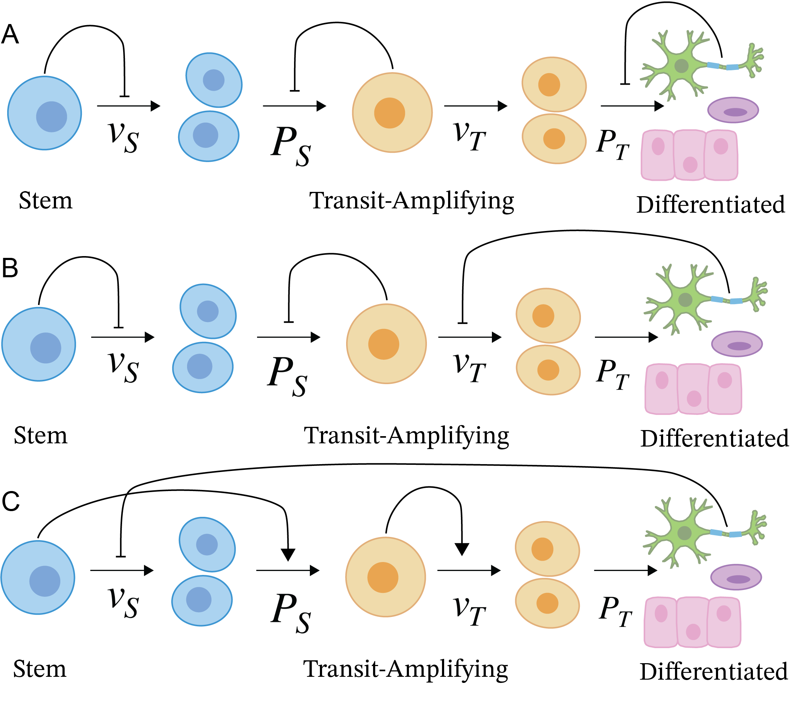

# Cell-Control-Architectures-Alife2023
The Degeneracy of Control Architectures in Cell Lineages: Implications for Tissue Homeostasis

In the most abstract form, we can understand tissues as being composed of three general cell types: stem cells, transit-amplifying cells, and differentiated cells. Additionally, we know that these cell types can secrete molecules or regulatory factors that can exert control over other cell populations. Recent work in theoretical biology examined several cell lineage control networks that result in tissue homeostasis. We develop an alternative mass action model that views developmental cell lineages as biological pathways. We demonstrate that three cell lineages are homeostatic irrespective of the implementation and that their control structures exhibit a degeneracy, containing solely negative feedback or negative resistance. We replicate and extend the homeostatic control architectures previously outlined and report on the relevant bifurcations and dynamics of these pathways. 

